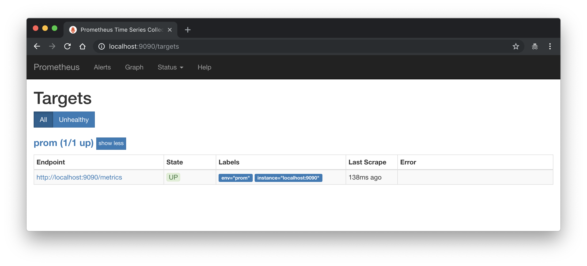

# prom-file-sd
Prometheus file service discovery with RESTful API

# Create directory for Prometheus data

```
mkdir -p prometheus_data
chown -R $USER:65534 prometheus_data
```

# Run

```
docker-compose up -d
```

# Add/Update target

```
curl -H 'Content-Type: application/json' \
    http://localhost:5000/targets \
    -d '{
    "target": "localhost:9090",
    "labels": {
        "env": "prom",
        "job": "prom"
    }
}'
```

# Delete target

```
curl -XDELETE \
    -H 'Content-Type: application/json' \
    http://localhost:5000/targets \
    -d '{"target": "localhost:9090"}'
```



# TODO
- [x] Add Support custom `metrics_path`  (e.g. `/api/v1/metrics`)
- [ ] Add Web UI


## Custom metrics_path

```
curl http://localhost:5000/targets -d '{
    "target": "example.com:3000",
    "labels": {
        "env": "prom",
	"job": "prom",
	"__metrics_path__": "/api/v1/metrics"
    }
}'
```

### USE FILE-BASED SERVICE DISCOVERY TO DISCOVER SCRAPE TARGETS
https://prometheus.io/docs/guides/file-sd/
